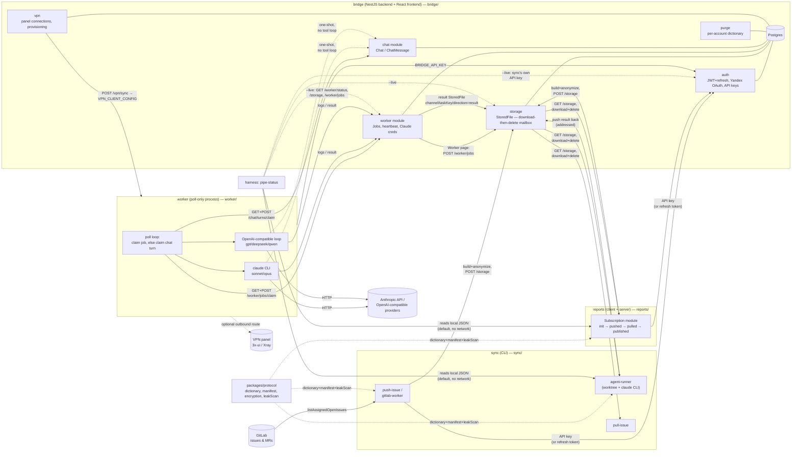

# Architecture: how every component talks to every other

Part of [ECOSYSTEM.md](../ECOSYSTEM.md)'s cross-cutting detail — see that
file for the full index. This is the one-diagram overview; each topic it
touches has its own deeper doc, linked below.

## The whole system

Solid arrows are the normal-path data flow; dashed arrows are either a
library dependency (`packages/protocol`, pulled in at build time, not a
network call) or an *optional* path (`--live`, the VPN route, worker ↔
chat). `BPurge` has no outbound edge of its own — it's a per-account
dictionary bridge's frontend reads/writes directly (`GET`/`PUT
/api/v1/purge/dictionary`), consumed client-side by Storage's pre-upload
leak scan and bridge's own Purge page, not by sync/reports/worker.

## Reading the diagram, by flow

- **Parcel push/pull** (`sync` ↔ `reports` ↔ bridge `storage`): the
  anonymize → zip+manifest → upload → download → de-anonymize round trip
  every arrow into/out of `BStorage` here represents. `gitlab-worker` and
  `pull-issue` typically run on one machine (the human's); `agent-runner`
  on another (the agent's) — see this file's own header diagram in
  [ECOSYSTEM.md](../ECOSYSTEM.md) for that left-to-right framing. Manifest
  versioning, the leak-scan, and multi-parcel addressing
  (`channel`/`taskKey`/`direction`, what lets a Worker job's result find its
  way back to the right `pull-issue`) are in
  [docs/parcel.md](parcel.md). What each side's own local state file tracks
  (and how `harness` merges them) is in [docs/state.md](state.md).
- **Worker Jobs**: created from bridge's Worker page (browser, `JwtGuard`)
  or indirectly by anything that already has a `StoredFile` to point at;
  claimed and run by the standalone `worker` process (`JwtOrApiKeyGuard`,
  `BRIDGE_API_KEY` only — see [docs/auth.md](auth.md)). `sonnet`/`opus`
  run the real `claude` CLI (`--dangerously-skip-permissions`, genuinely
  arbitrary code execution — why `worker` is its own isolated Swarm
  service, no access to bridge's DB/secrets); `gpt`/`deepseek`/`qwen` run a
  minimal OpenAI-compatible tool-calling loop instead. A job's result is
  uploaded back to `storage` with the same addressing its source file had,
  so it's indistinguishable from a human-pushed result to anything pulling
  it later.
- **Chat**: a separate, much simpler lane through the same `worker`
  process — one model call, no files, no tool loop, no parcel at all.
  Shares `gpt`/`deepseek`/`qwen`'s provider config with Jobs; `sonnet`/
  `opus` chat bypasses the `claude` CLI entirely (a direct Anthropic
  Messages API call) rather than spawning it for a plain conversation. No
  websocket/SSE anywhere in bridge — like everything else, the frontend
  polls `GET /chat/chats/:id/messages`.
- **harness / `--live`**: by default, `pipe-status` only reads local state
  files (dashed `Harness --> Sync/Reports` edges are actually local
  filesystem reads, not network calls — drawn as edges here only to show
  *which* components it's reading from). The optional `--live` flag adds
  the three dashed edges into bridge: it reuses `sync`'s own stored API key
  (no separate login) to turn a locally-inferred guess ("likely ready to
  pull") into a bridge-confirmed fact. See `harness/README.md` and
  [IMPROVEMENTS_HARNESS.md](improvements/IMPROVEMENTS_HARNESS.md) item 1.1.
- **Auth**: every machine-to-bridge edge above (`sync`, `reports`,
  `worker`, `harness --live`) authenticates the same way — a personal API
  key through `JwtOrApiKeyGuard`, sync/reports also tolerating a
  refresh-token fallback `worker` deliberately doesn't. Full detail,
  including rate limiting, in [docs/auth.md](auth.md).
- **VPN**: unrelated to the parcel/Job/Chat data path — a separate concern
  for routing `worker`'s *outbound* calls to AI providers through a
  provisioned panel when the host is geo-restricted. `bridge`'s `vpn`
  module manages panel connections and rebuilds `worker`'s Xray client
  config on activation; `worker` itself only ever reads that config, it
  never talks to the panel API directly. Full detail (including the
  provisioning workflow) in [docs/deploy.md](deploy.md).

## What's deliberately not in this diagram

Ports, the full secrets/env-var table, and local-dev URLs are in
[docs/deploy.md](deploy.md) — this diagram is the logical component graph,
not a deployment topology (in production, `bridge` and `worker` are
separate Swarm services; in local dev, everything in `Sync`/`Reports`
commonly runs on the same machine as `Bridge`). CI/build dependency order
(`protocol` → everything else) is a separate graph from this one — see
`.github/workflows/ci.yml` and this repo's root `CLAUDE.md`.
